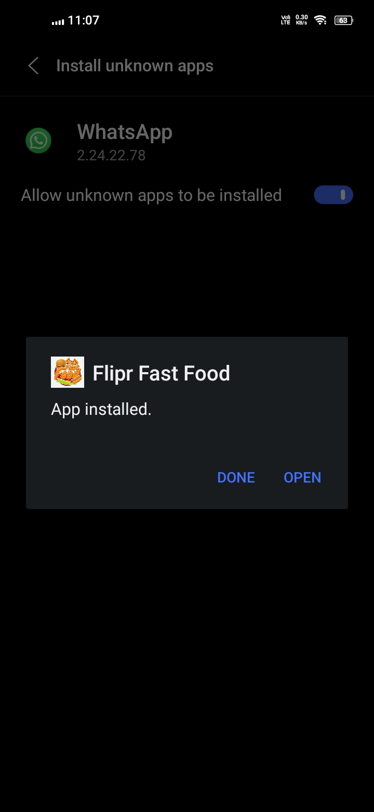
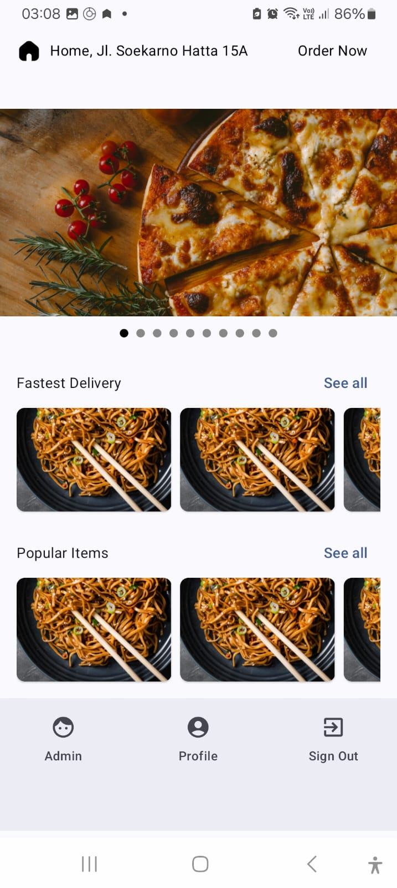

# Flipr Fast Food App

**Flipr Fast Food** is an Android app designed to provide users with an easy and fast way to order food. With features like browsing food items, customizing orders, and secure payment options, it ensures a smooth and convenient experience for fast food lovers.

##Feature like login with signup and login with email Firebase use


**Only valid email can signup
##(abc@flipr.ai) , password (More Than 8 Char.)


**For Api Retrofit is used**


## Screenshots

Here are some screenshots of the app:

**Initial Apk Installation in device**



**This is Splash Screen**


**This is welcome page.**


**This is Home Page**



**This Is login Pagee with Toast messege show that email can not be Empty**


**This is SignUp Page**


shots of the app at different stages:
 
*Browse Food Items*

---

## Features

- Browse a wide range of food items.
- Customize orders with add-ons.
- Apply discounts and track your order.
- Secure payment options.
- User-friendly interface.

---

## Installation

Follow these steps to set up and run the Flipr Fast Food app on your machine.

### Step 1: Clone the Repository

To get started, first clone the repository to your local machine by running the following command in your terminal:

```bash
git clone https://github.com/abhishekojha06/flipr-fast-food-app.git
